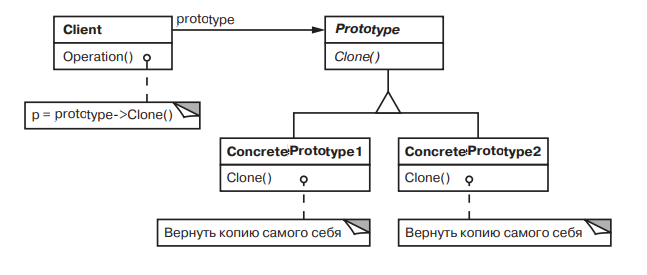

# Prototype

### Название и классификация:
_Прототип_ – паттерн, порождающий классы.

### Назначение:
Задает виды создаваемых объектов с помощью экземпляра-прототипа и создает новые объекты путем копирования этого прототипа.

### Применимость:
Используйте паттерн `прототип`, когда система не должна зависеть от того, как в ней создаются, компонуются и представляются продукты; _кроме того_:
*	классы для создания экземпляров определяются во время выполнения, например с помощью динамической загрузки; _или_
*	для того чтобы избежать построения иерархий классов или фабрик, параллельных иерархий классов продуктов; _или_
*	экземпляры класса могут находиться в одном из не очень большого числа различных состояний. Может быть удобнее установить соответствующее число прототипов и клонировать их, а не создавать экземпляр каждый раз вручную в подходящем состоянии.

### Структура: 

### Результаты:
У прототипа те же самые результаты, что у [_абстрактной фабрики_](https://github.com/a1sarpi/Patterns/tree/main/AbstractFactory) и у [_строителя_](https://github.com/a1sarpi/Patterns/tree/main/Builder): он скрывает от клиента конкретные классы продуктов, уменьшая тем самым число известных клиенту имен. Кроме того, все эти паттерны позволяют клиентам работать с классами, специфичными для приложения, без модификаций.
Ниже перечислены дополнительные преимущества паттерна `прототип`:
*	добавление и удаление продуктов во время выполнения (прототип позволяет включать новый конкретный класс продуктов в систему, просто зарегистрировав новый экземпляр-прототип на стороне клиента)
*	определение новых объектов путем изменения значений (такой дизайн позволяет пользователям определять новые «классы» без программирования. Фактически клонирование объекта аналогично созданию экземпляра. Паттерн позволяет резко уменьшить число необходимых системе классов)
*	определение новых объектов путем изменения структуры (просто добавляем подсхему как прототип в палитру доступных элементов схемы; при условии, что объект, представляющий составную схему, реализует операцию `Clone` как глубокое копирование, схемы с разными структурами могут выступать в качестве прототипов)
*	уменьшение числа подклассов
*	динамическая настройка конфигурации приложения классами
*	основной недостаток, что каждый подкласс класса `Prototype` должен реализовывать операцию `Clone`, а это не всегда просто. 
